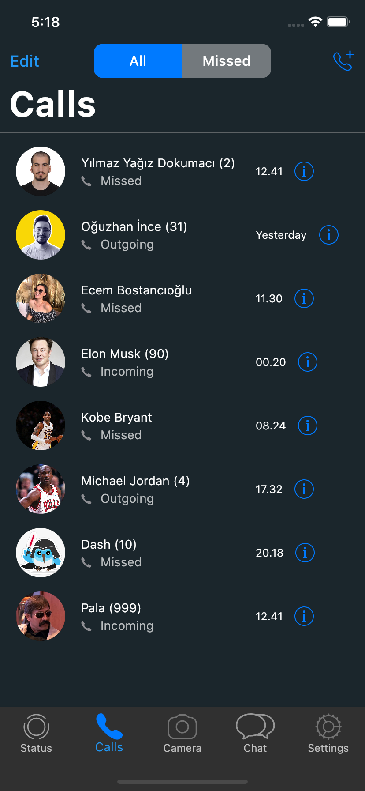

# Flutter - Whatsapp Clone

Whatsapp Clone App I made with Flutter.


## Run Locally

Clone the project

```bash
  git clone https://github.com/yagizdo/flutter_whatsapp_clone
```

Go to the project directory

```bash
  cd flutter-whatsapp-clone-master
```

Install dependencies

```bash
  flutter pub get
```

Run App

```bash
  flutter run
```


## What will be add :question:

- [x] Splash Screen
- [ ] Auth with Phone number
- [x] Dark Mode
- [x] Message slides with slidable(unread,archive etc.)
- [ ] Onboarding Screen(get user name and profile pic)
- [x] Chat Screen
- [ ] Image Picker(For profile pic)
- [ ] State Management
- [x] Profile Page
- [x] Settings Page


##  Libraries I use in the application:
- Animated Splash Screen : https://pub.dev/packages/animated_splash_screen
- Provider : https://pub.dev/packages/provider
- Shared Preferences : https://pub.dev/packages/shared_preferences
- Hex Color : https://pub.dev/packages/hexcolor
- Flutter Svg : https://pub.dev/packages/flutter_svg
- Toggle Switch : https://pub.dev/packages/toggle_switch
- Flutter Slidable : https://pub.dev/packages/flutter_slidable
- Cupertino List Tile : https://pub.dev/packages/cupertino_list_tile

## Screenshots

### Splash Screen 


## Light Mode
### Status Screen


### Calls Screen


### Chats Screen


### Settings Screen


## Dark Mode
### Status Screen


### Calls Screen


### Chats Screen


### Settings Screen


## Contributing

Contributions are always welcome!
